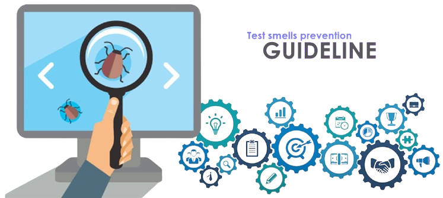

 
 <h2>Welcome 👋</h2>

📌 This reade.me  xxxx </i> xxx 

📎 Link to paper <a href="testsmells">[not available]</a>

📋 <b>Abstract:</b>xxxxxx
  

 <h2>Test code </h2>

 <h2>Test smells 🐞</h2>

 ➡ See <a href="testsmells.md" >definitions</a> of test smells

 <h2>Test smells prevention guideline 🧹</h2>

<!--
 ➡ See <a href="testcodrefactoring.md" >definitions</a> of refactorings
-->

 <h2>Contributions 🤝</h2>

Contributions to maintain this summary up to date are appreciated and encouraged. Please submit your pull request. 

