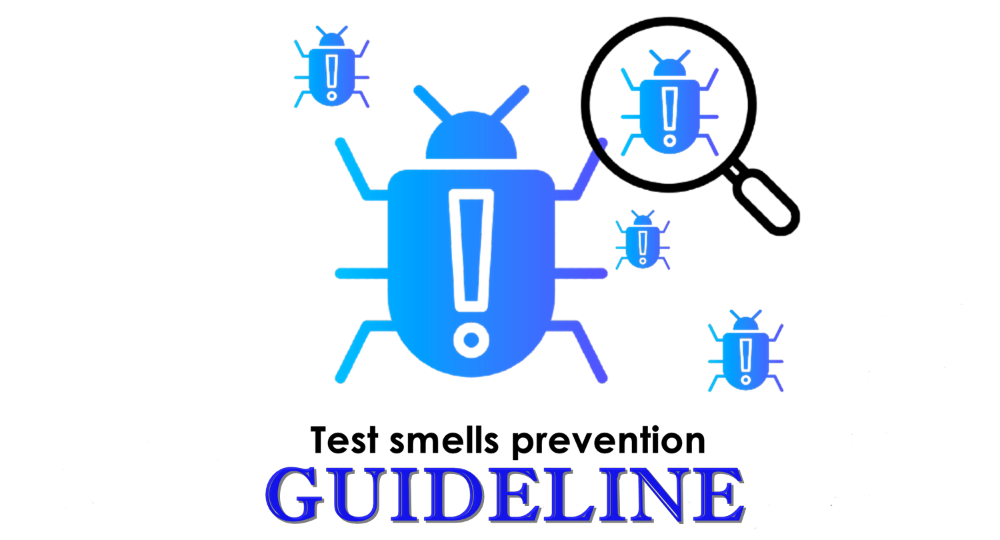

 
 <h2>Welcome 👋</h2>

📌 This reade.me  xxxx </i> xxx 

📎 Link to paper <a href="testsmells">[not available]</a>

📋 <b>Abstract:</b>xxxxxx
  

 <h2>Test code </h2>

If your <b> test code</b> contains any of the following structures, your test case may contain <b>"test smells"</b>.

* A test method that contains multiple assertion statements without an argument as a parameter;
* A test method that contains one or more control statements, i.e, if, switch, conditional expression, for, foreach, or while statements;
* Method with more than one assertion statement with the same parameters;
* Method contains an instance of a File class without calling the methods Exists(), isFile() or noExists() methods of the object;
* Method that invokes the Thread.sleep() method;
* Method does not contain a single assertion statement and @Test (expected) annotation parameter.

 <h2>What are test smells? 🐞</h2>

<b>Test smells</b> are indications of problems or bad practices in software testing that can lead to inefficient testing or even failure to identify software problems s (PALOMBA
et al., 2016; PERUMA, 2018; GAROUSI, 2018; ALJEDAANI et al., 2021).  The literature presents several types of test smells. GAROUSI, 2018 presents a catalog with more than 80 ones.
For this study, we will address the 6 most cited test smells in the literature, which are:

* Assertion Roulette (AR)
* Conditional Logic Test (CTL)
* Duplicate Assert (DA)
* Resource Optimism (RO)
* Sleepy Test (ST)
* Unknown Test (UT)

 ➡ See <a href="testsmells.md" >definitions and exemplo </a> of test smells

 <h2>Test smells prevention 🧹</h2>

To prevent these kinds of problems known as <b>"test smells"</b> from occurring in test code, it is important to avoid certain scripting structures in the test code. 
In the following we will show some structures that will help developers avoid having the following test smells in their test code.

 ➡ See <a href="testcodreprevention.md" >prevention and exemplo </a> of test smells

 <h2>Contributions 🤝</h2>

Contributions to maintain this summary up to date are appreciated and encouraged. Please submit your pull request. 

