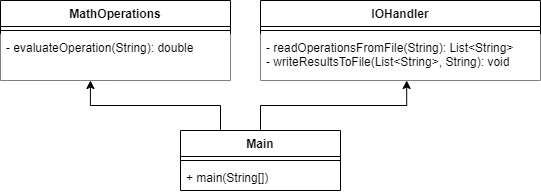
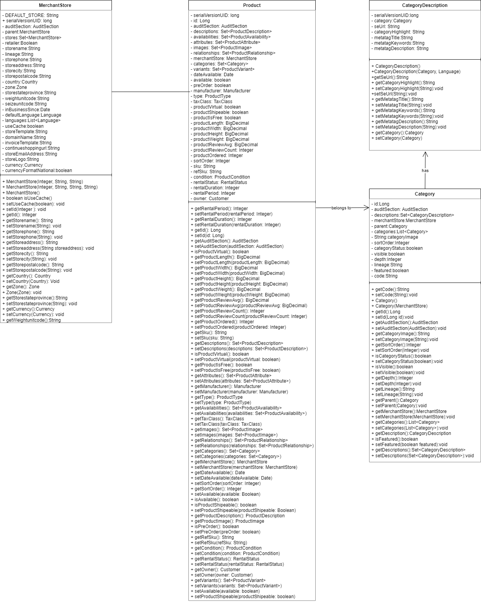
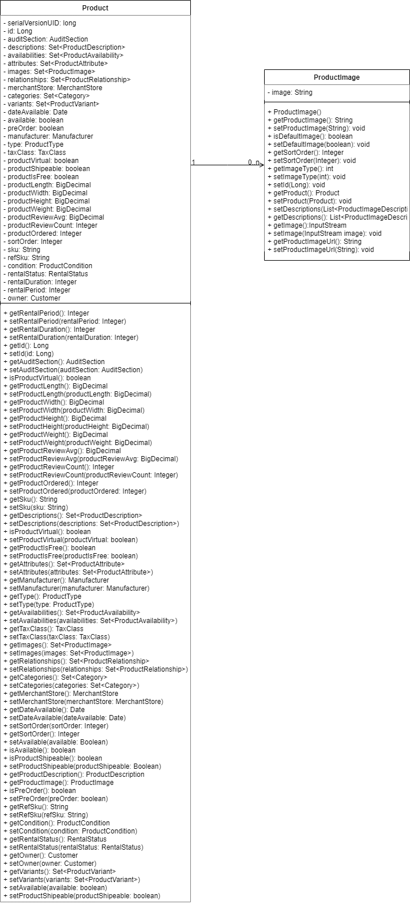
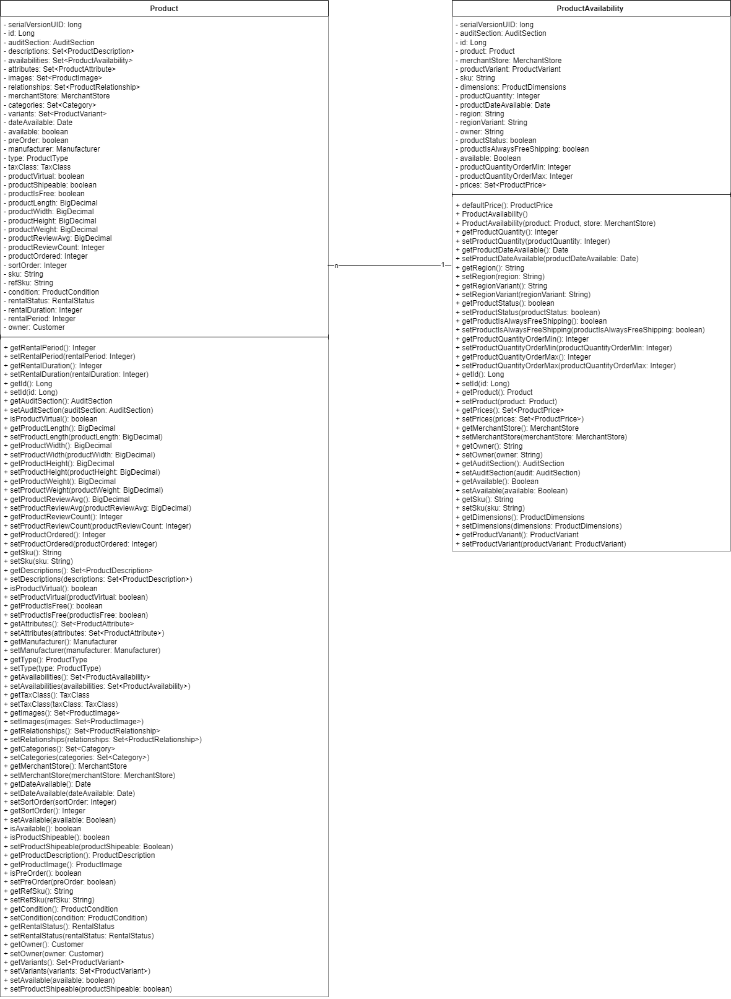
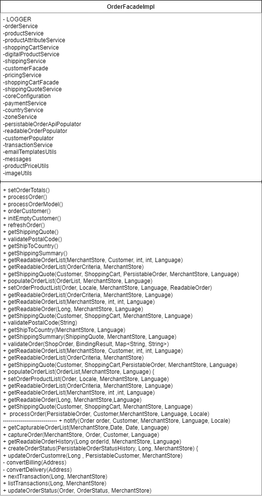

🔙 <a href="README.md">Back to previous page</a> 

 <h2>Calculator Task</h2>

## Production classes description

**1) MathOperations:**
* MathOperations is the production class responsible for performing an operation between two operands.

**2) IOHandler**
* IOHandler reads an external file to perform several math operations, then saves the output in another file
* The expected format in the file is `operand operator operand` per line

**3) Main**
* Mains handles the calls for the MathOperations and IOHandler.

## Task #1 - Develop Test Code for the Calculator Class

*Description:*
Objective: Create test cases to thoroughly test the divide method of the Calculator class to verify the edge values for the division operation.

Diagram 5 - Relationship between the class MathOperations and IOHandler 

*Test steps:* Considering the class MathOperations, create a test class named MathOperationsTest for the scenarios:

1. Division of positive integers (dividend > divisor).
2. Division of negative integers (dividend < 0, divisor > 0).
3. Division by zero (divisor == 0)

## Task #2 - Reading from an External Database File

*Description:*
Objective:  Create test cases for production classes that involve reading data from external files, such as a database.

*Test steps:* Considering the IOHandler class, please create a IOHandlerTest class to verify the scenarios:
1. Test the IOHandler ability to read data from the external database file
3. Verify that the content read from the file matches the expected format `operand operator operand`, e.g., `1 + 5`

 <h2>Store Task</h2>

## Production classes description

**1) Product:**
- A Product represents an item available in an online store. 
- Each Product has various attributes like dimensions, SKU, manufacturer, type, etc. 
- It has a set of ProductDescription instances that provide details about the product in different languages. 
- It is associated with one or more Category instances, indicating the categories to which the product belongs. 

**2) MerchantStore:**
- A MerchantStore represents an online store. 
- It serves as the context for products and categories, indicating which products and categories belong to which store.

**3) Category:**
- A Category represents a product category or classification.
- Each Category has a set of CategoryDescription instances that provide details about the category in different languages.
- It can have child categories, indicating a hierarchical structure.
- It can have parent categories, indicating its position in the hierarchy.
- It is associated with one or more Product instances, indicating the products that belong to the category.

**4) CategoryDescription:**
- A CategoryDescription provides details about a category in a specific language.
- It is associated with a Category, indicating the category it describes.

**5) ProductImage:**
- A ProductImage provides images for each product in a store.

**6) ProductAvailability:**
- A ProductAvailability indicates whether the product is available, the number max and min for an order
- Each Product may have a description indicating the ProductAvailability

**7) OrderFacadeImpl**
- OrderFacadeImpl shows a communication interface between the store and user.

## Task #1 - Verifying Product Categorization in an Online Store

*Description:* 
Diagram #1 presents the relationship between the Product, MerchantStore, Category, and CategoryDescription.
Our goal is to verify that product categorization within an online store is functioning correctly.

Diagram 1 - Relationship between products, merchant and categories 

*Test Steps:*
Please, use the `MerchantStore` object to test the scenarios of creating different category of products for a store. 

A store with one category of products
 1. Create a `Category` of objects called `book` and set it into the `MerchantStore`.
 2. Create a `Set` of `CategoryDescription` objects and add two books.
 3. Insert the `Set` of `CategoryDescription` into book category
 4. Insert the `MerchantStore` object into `Product` object;
 5. Ceck the if the number of categories into the object `Product` is equal to 2
 
Expand the store with another category of products
  1. Create a `Category` of objects called `music` and set it into the `MerchantStore`
  2. Create a `Set` of `CategoryDescription` objects and add two discographies.
  3. Insert the `Set` of `CategoryDescription` into the music category
  4. Insert the `MerchantStore` object into `Product` object
  5. Check the if the number of categories into the object `Product` is equal to 4
   
## Task #2 - Verifying Image Insertion for a Product

*Description:*
Diagram #2 presents the relationship between the Product and ProductImage.
Our goal is to verify that an image can be successfully inserted into a product's list of images.

Diagram 2 - Relationship between products and images 

*Test steps:*
Please, create a test method called `testInsertImage` to insert a local file into a product.
1. Specify the path to the image file you want to read.  
2. Create the `File` object representing the file you want to read.
3. Use the `FileInputStream` - an external Java class - to create an `InputStream` object that reads from the specified file (e.g., `InputStream inputStream = new FileInputStream(file);`).
4. Create an `ProductImage` object. Then set the image as an `InputStream` object, set the `Product` object, and other attributes you may find necessary.
5. Insert the `ProductImage` object into the list of images (`Set<ProductImage>`) of the `Product` object.
6. Check whether the `Product` constains the `ProductImage`.  

## Task #3: Verifying Product Availability After Order

*Description:*
Diagram #3 presents the relationship between the Product and ProductAvailability.
Our goal is to verify that the product availability decreases as expected after orders are placed.

Diagram 3 - Relationship between products and products availability 

*Test steps:*
The `ProductAvailabilityTest` class contains two fields that are initialized in the `setup` method. 
Please, use those fields to develop a test method called `testOrderDecreasesProductAvailability`. The test method should simulate orders of 20 items of a product. 
Note that the store has 100 items available of such products.
1. Simulate an order by decreasing the `productQuantity` of the `ProductAvailability` object by the test order quantity.
2. Retrieve the updated `productQuantity` value after the order.
3. Verify whether the updated `productQuantity` value matches the initial value minus the test order quantity.

## Task 4: Asynchronous Email Notification

*Description:*
Diagram #4 presents the class `OrderFacadeImpl` to deal with asyncronous events.
Our goal is to verify that the `notify` method properly sends order confirmation emails to customers and merchants asynchronously.

Diagram 4 - Relationship between products and products availability 

*Test steps:*
The `testNotifyMethod` provides some dummy configuration to call the `notify` production method. 
In addition, it provides Autowire an instance of the `AsyncService` class to the test.
Please, use this initial configuration to verify whether the email is sent following the steps:
1. Call the `notifyA` method of the `AsyncService` class to start the asynchronous method.
2. Simulate the asynchronous processing by waiting for 3 seconds.
3. Verify that the `isEmailSent` method of the `AsyncService` class returns true, indicating that the email was sent.

