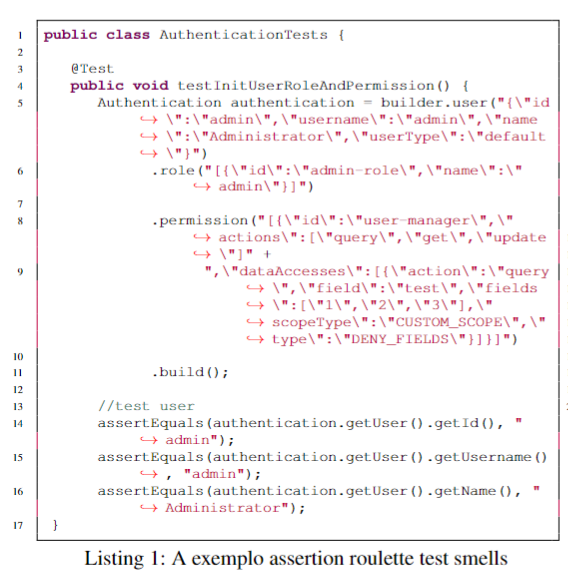
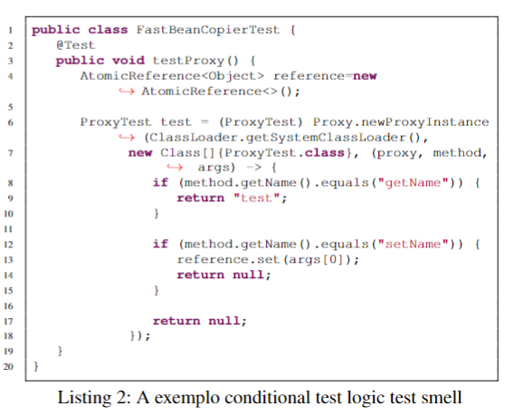
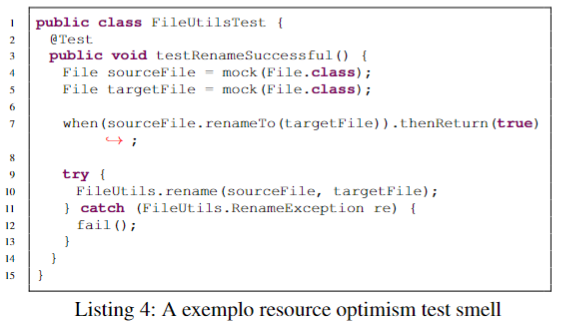
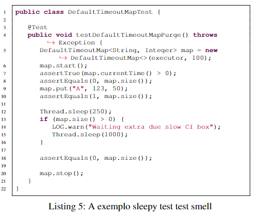
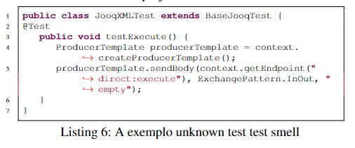

🔙 <a href="README.md">Back to previous page</a> 

 <h2>Definition and exemplo of test smells 🐞🐞🐞</h2>

📌 This reade.me, we will introduce the definitions of each of the test smells and present examples of these test smells. </i>  

 <h2>Test smells 🐞</h2>

* <b>Assertion Roulette (AR):</b>
  It occurs when multiple assertion statements are present in a test method without any explanation or parameter in the assertion
   method, it can cause confusion and make it difficult to identify which assertion has failed if the test fails (Van Deursen et. al, 2001).
    * <b>Detection:</b> A test method that contains multiple assertion statements without an argument as a parameter.
    * <b>Exemplo:</b> Listing 1 presents a test method containing AR (line 14). The example presents a method of test class AuthenticationTests of the hsweb-framework.

  

 
  

* <b>Conditional Logic Test (CTL):</b>
  It occurs test methods contain conditional logic statements (e.g., if-else, while, for). The presence of conditions in test methods can
  alter the test's behavior and expected outcomes. Consequently, this can create scenarios in which the tests fail to uncover defects in
  the production method (PERUMA et. al, 2018).
     * <b>Detection:</b> A test method that contains one or more control statements, i.e., if, switch, conditional expression, for, foreach, or while statements.
     * <b>Exemplo:</b> Listing 2 presents a test method containing CTL (lines from 8 to 10). The example presents a method of test class FastBeanCopierTest from the hsweb-framework project.

 

 
  

  
* <b>Duplicate Assert (DA):</b>
  It occurs when a test method checks the same assertion more than once in the same method but with different values.
  When a test method has multiple assertions that are repeated, it can make the purpose of the method harder to comprehend PERUMA, 2018).
    * <b>Detection:</b> In the test method, there is more than one assertion statement with the same parameters.
    * <b>Exemplo:</b>  Listing 3 presents a test method containing DA (lines from 9 to 13). The example presents a method of test class HashMapTwoFactorTokenManagerTest from the hsweb-framework project.

  

 
  

  
* <b>Resource Optimism (RO):</b>
  The test method uses a resource without first checking its state. It's important to be cautious when testing code
  that relies on external resources like directories or database tables. Assuming that these resources exist or are in a certain state can
  lead to unpredictable results in your tests (Van Deursen et. al, 2001).
    * <b>Detection:</b> Test method contains an instance of a File class without calling the methods exists(), isFile(), or noExists() methods of the object.
    * <b>Exemplo:</b> Listing 4 presents a test method containing RO (Lines from 2 to 15). The example presents a method of test class FileUtilsTest from the fresco project.

  

 
  

  
* <b>Sleepy Test (ST):</b>
  It occurs when the test method pauses for a certain period by simulating or waiting for an external event (using Thread.sleep()),
  and then continues execution usually (PERUMA et. al, 2018).
    * <b>Detection:</b> A test method that invokes the \textit{Thread.sleep()} method.
    * <b>Exemplo:</b> Listing 5 presents a test method containing ST (line 12). The example presents a method of test class DefaultTimeoutMapTest from the pache/camel project.

  

 
  

  
* <b>Unknown Test (UT):</b>
  It occurs when the test method that does not contain assertion. An assertion statement describes an expected condition
  for a test method (PERUMA et. al, 2018).
    * <b>Detection:</b>  A test method does not contain a single assertion statement and \textbf{@Test} (expected) annotation parameter.
    * <b>Exemplo:</b> Listing 6 presents a test method containing UT (lines from 2 to 15). The example presents a method of test class RedisUserTokenManagerTest from the hsweb-framework project.

 

 
  

  
